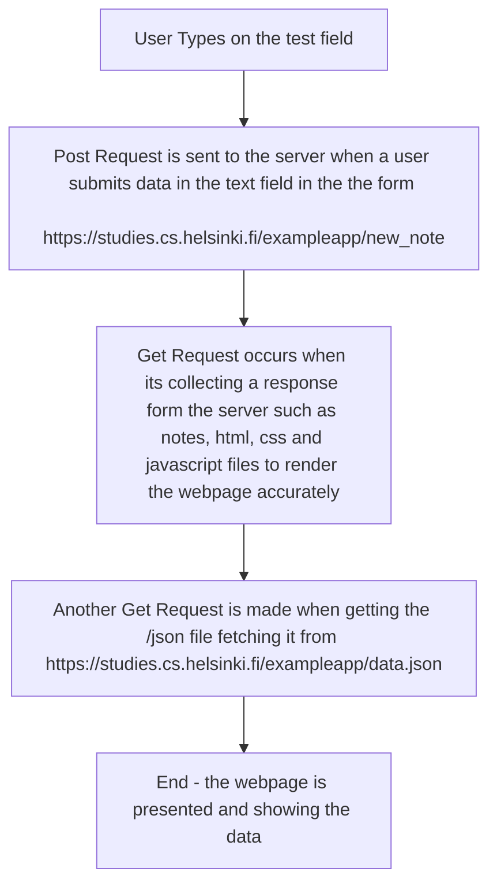

```mermaid

graph TD;
    A[User Types on the test field] --> B[Post Request is sent to the server when a user submits data in the text field in the the form 
    https://studies.cs.helsinki.fi/exampleapp/new_note];
    B --> C[Get Request occurs when its collecting a response form the server such as notes, html, css and javascript files to render the webpage accurately ];
    C --> D[Another Get Request is made when getting the /json file fetching it from https://studies.cs.helsinki.fi/exampleapp/data.json ];
    D --> E[End - the webpage is presented and showing the data];


```

