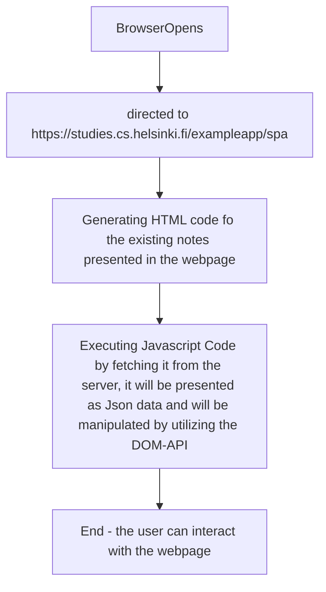

```mermaid

graph TD;
    A[BrowserOpens  ] --> B[directed to https://studies.cs.helsinki.fi/exampleapp/spa];
    B --> C[Generating HTML code fo the existing notes presented in the webpage ];
    C --> D[Executing Javascript Code by fetching it from the server, it will be presented as Json data and will be manipulated by utilizing the DOM-API];
    D --> E[End - the user can interact with the webpage ];


```
