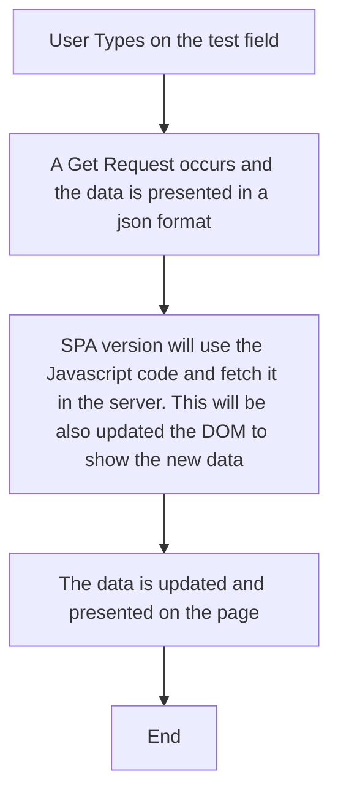

```mermaid

graph TD;
    A[User Types on the test field] --> B[A Get Request occurs and the data is presented in a json format];
    B --> C[SPA version will use the Javascript code and fetch it in the server. This will be also updated the DOM to show the new data ];
    C --> D[The data is updated and presented on the page];
    D --> E[End];


```
